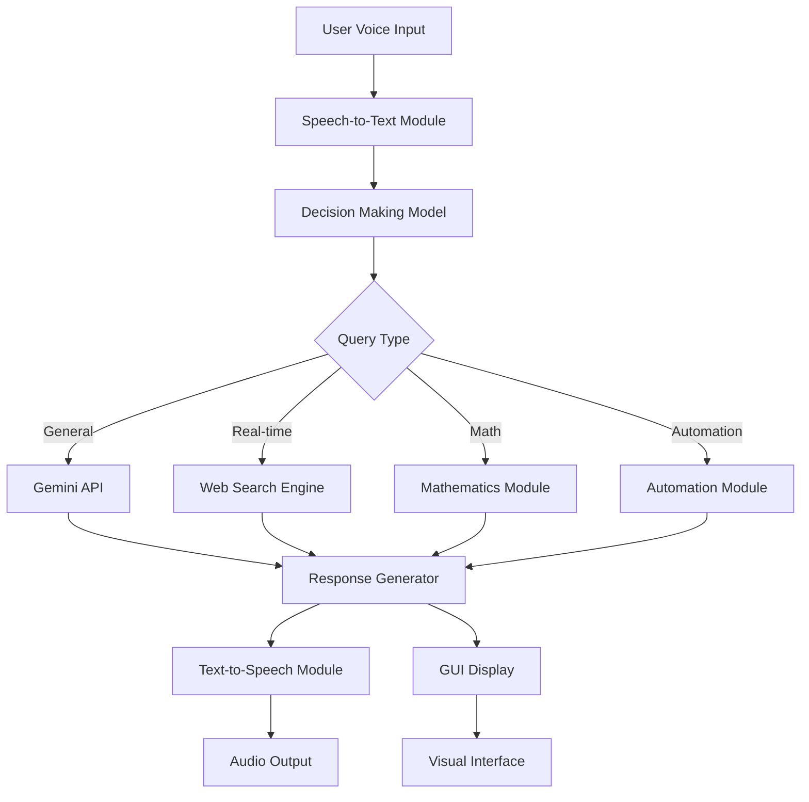

# Jasmine AI Assistant

<p align="center">
  
</p>

An advanced AI-powered personal assistant with voice interaction capabilities, featuring real-time search, task automation, mathematical problem solving, and multimodal AI capabilities.

## 🌟 Features

- **Voice Interaction**: Natural language processing with speech-to-text and text-to-speech
- **Real-time Information**: Live web search and up-to-date information
- **Task Automation**: Application control, system commands, and content generation
- **Mathematical Problem Solving**: Calculus, algebra, and complex equation solving
- **Multimodal AI**: Text, image, and audio processing capabilities
- **Cross-Platform Support**: Works on Windows, macOS, and Linux

## 🏗️ Architecture Overview



## 🔧 Core Components

### 1. Main Controller (`Main.py`)
The central orchestrator that manages all system components:
- Initializes the GUI and backend services
- Processes user input through the decision-making model
- Routes queries to appropriate modules
- Manages conversation history and state

### 2. Decision Making Model (`Backend/Model.py`)
Intelligent routing system powered by Cohere API:
- Classifies user queries into categories:
  - General conversation
  - Real-time information needs
  - Mathematical problems
  - Task automation requests
  - Content generation
- Determines appropriate processing pathway

### 3. AI Processing Modules

#### Gemini API Integration (`Backend/GeminiAPI.py`)
Advanced AI capabilities including:
- Natural language conversations
- Mathematical problem solving
- Code explanation and debugging
- Image analysis with vision capabilities
- Audio processing and speech recognition

#### Mathematics Engine (`Backend/Mathematics.py`)
Specialized mathematical computation:
- Calculus (derivatives, integrals)
- Algebra (equation solving)
- Limits and series
- Symbolic computation with SymPy

### 4. Automation System (`Backend/Automation.py`)
Task execution capabilities:
- Application opening/closing
- Web search and navigation
- System command execution
- Content generation and file management

### 5. Voice Processing

#### Speech Recognition (`Backend/SpeechToText.py`)
Multiple speech recognition options:
- Web-based speech recognition
- Gemini-powered audio processing
- Multi-language support

#### Text-to-Speech (`Backend/TextToSpeech.py`)
Natural voice output:
- Murf AI premium voices
- Edge TTS fallback
- Audio playback optimization

### 6. Real-time Search (`Backend/RealtimeSearchEngine.py`)
Live information retrieval:
- Google search integration
- Weather information
- Current events and data

### 7. User Interface (`Frontend/GUI.py`)
Modern graphical interface:
- PyQt6-based responsive design
- Animated elements and visual feedback
- Live transcription display
- Status indicators

## 🚀 Getting Started

### Prerequisites
- Python 3.8 or higher
- Chrome browser (for speech recognition)
- API keys for:
  - Google Gemini
  - Cohere
  - Groq (optional)

### Installation

1. **Clone the repository**:
   ```bash
   git clone https://github.com/yourusername/jasmine-ai.git
   cd jasmine-ai
   ```

2. **Install dependencies**:
   ```bash
   pip install -r Requirements.txt
   ```

3. **Configure environment variables**:
   ```bash
   cp .env.template .env
   # Edit .env with your API keys
   ```

4. **Run the application**:
   ```bash
   python Main.py
   ```

## 🎙️ Usage

### Voice Commands
The assistant responds to various types of queries:

#### General Conversations
- "Hello, how are you?"
- "Tell me a joke"
- "What's your name?"

#### Real-time Information
- "Who is the current president?"
- "What's the weather in New York?"
- "Latest technology news"

#### Task Automation
- "Open Chrome"
- "Play some music"
- "Close Notepad"
- "Search Python tutorials on YouTube"

#### Mathematical Problem Solving
- "Integrate x squared"
- "Solve x^2 + 5x + 6 = 0"
- "What is the derivative of sin x?"

#### Content Generation
- "Write an application for sick leave"
- "Create a shopping list"
- "Generate a poem about nature"

## 📁 Project Structure

```
Jasmine_ai/
├── Backend/
│   ├── Automation.py          # Task automation system
│   ├── Chatbot.py             # Legacy chatbot (superseded by Gemini)
│   ├── GeminiAPI.py           # Google Gemini integration
│   ├── ImageGeneration.py     # Image creation capabilities
│   ├── LiveSpeechToText.py    # Real-time speech processing
│   ├── Mathematics.py         # Mathematical computation engine
│   ├── Model.py               # Decision making model (Cohere)
│   ├── RealtimeSearchEngine.py # Web search and information retrieval
│   ├── SpeakerVerifier.py     # Voice authentication
│   ├── SpeechToText.py        # Speech recognition
│   └── TextToSpeech.py        # Text-to-speech conversion
├── Data/
│   ├── ChatLog.json           # Conversation history
│   └── [Temporary files]      # Runtime data storage
├── Frontend/
│   ├── GUI.py                 # Graphical user interface
│   └── Graphics/              # Visual assets
├── docs/                      # Documentation files
├── tests/                     # Unit and integration tests
├── utils/                     # Utility scripts
├── .env                       # Configuration file (not in repo)
├── Main.py                    # Application entry point
└── Requirements.txt           # Python dependencies
```

## 🔧 Configuration

Create a `.env` file in the project root with your API keys:

```env
# Core API Keys
GEMINI_API_KEY=your_gemini_api_key
CohereAPIKey=your_cohere_api_key
GroqAPIKey=your_groq_api_key

# User Preferences
Username=Your Name
Assistantname=Jasmine

# Voice Settings
AssistantVoice=en-US-JennyNeural
InputLanguage=en
```

## 🧪 Testing

Run the test suite to verify functionality:

```bash
# Run all tests
python -m pytest tests/

# Run specific test modules
python tests/test_mathematics.py
python tests/test_speech.py
python tests/test_automation.py
```

## 🛠️ Troubleshooting

### Common Issues

1. **Microphone Not Working**:
   - Check system microphone permissions
   - Verify Chrome has microphone access
   - Run `utils/toggle_microphone.py true`

2. **API Key Errors**:
   - Ensure `.env` file is properly configured
   - Verify API keys are active and have correct permissions

3. **Application Opening Issues**:
   - Check platform-specific app name mappings in `Backend/Automation.py`
   - Ensure applications are installed on your system

4. **Voice Output Problems**:
   - Verify audio drivers are working
   - Check system volume settings
   - Try different TTS providers in `Backend/TextToSpeech.py`

## 🤝 Contributing

1. Fork the repository
2. Create a feature branch
3. Commit your changes
4. Push to the branch
5. Create a Pull Request

## 📄 License

This project is licensed under the MIT License - see the [LICENSE](LICENSE) file for details.

## 🙏 Acknowledgments

- Google Gemini for AI capabilities
- Cohere for decision-making model
- PyQt6 for the graphical interface
- All open-source libraries and tools used in this project

## 📞 Support

For issues, questions, or contributions, please open an issue on GitHub or contact the maintainers.